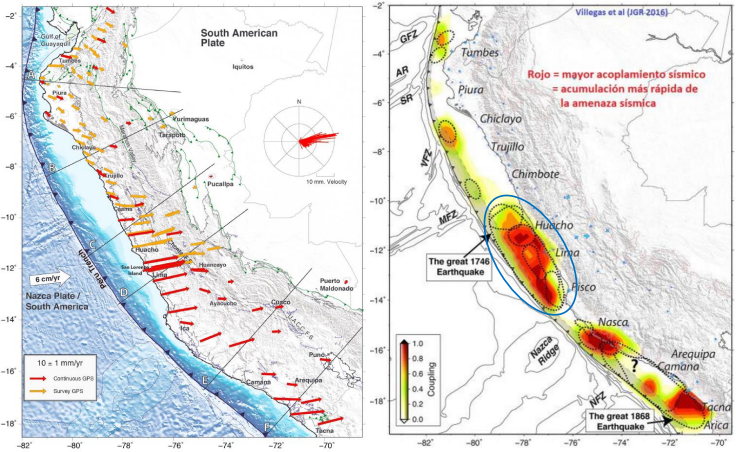

# Peligro Sísmico

La prolongada ausencia de rupturas significativas en la zona central del Perú desde el sismo de 1746 (silencio sísmico) sugiere una acumulación crítica de energía que incrementa la probabilidad de un evento extremo de subducción.

  
   
  <em>Fuente: Instituto Geofísico del Perú (IGP)</em>

En este módulo se presentará una introducción a la Evaluación Probabilistica de Peligro Sísmico (PSHA), fuentes generadoras en el Perú y modelamiento numérico en los software Crisis2007 y OpenQuake.

## PSHA

El **PSHA** se basa en considerar todas las combinaciones posibles —pero físicamente relevantes— de eventos sísmicos que podrían afectar un sitio, junto con sus tasas de ocurrencia. Bajo este enfoque, el peligro sísmico se define como la **probabilidad** de que, en un sitio específico, ocurra un sismo capaz de generar una intensidad igual o mayor que un umbral dado dentro de un periodo de tiempo determinado.

Esta probabilidad se calcula asumiendo que los sismos siguen un proceso de **Poisson**, lo que implica que:

- La ocurrencia de eventos en un intervalo de tiempo es independiente de la ocurrencia en otros intervalos.
- La probabilidad de ocurrencia en un intervalo corto de tiempo es proporcional a la duración del mismo.
- La probabilidad de que más de un sismo ocurra en un intervalo de tiempo muy corto es despreciable.

Adicionalmente, se considera que la **intensidad sísmica** (**I**) en un sitio depende tanto del tamaño del sismo (representado por su magnitud **s**) como de su distancia (**r**) al sitio de interés. Estas variables se modelan como aleatorias continuas mediante funciones de densidad de probabilidad \\(f_s(s)\\) y \\(f_r(r)\\). Así, la probabilidad de que la intensidad sísmica supere un valor **i** se expresa como \\(P(I \geq i)\\), integrando las contribuciones de todos los posibles escenarios sismológicos y sus efectos en el sitio.

---

### Tasa anual de excedencia

La **tasa anual de excedencia** de una intensidad sísmica IM superior a un umbral x en un sitio específico se define como:

$$
\lambda(IM > x) = \sum_{i=1}^{N_s} \iint_S \int_{M_{min}}^{M_{max}} \int_{R_{min}}^{R_{max}} \nu_i(M) \cdot f_R(R|M) \cdot P(IM > x \mid M, R) \, dR \, dM \, dS
$$

donde:

- \\(N_s\\) es el número de fuentes sismogénicas consideradas.
- \\(nu_i(M)\\) representa la **tasa anual de ocurrencia** de sismos de magnitud M en la fuente i, obtenida a partir de su modelo de recurrencia sísmica.
- \\( f_{(R \mid M)} \\)es la función de densidad de probabilidad de la distancia $R$ al sitio, condicional a la magnitud **M**.
- \\(P(IM > x \mid M, R)\\) es la probabilidad de que la intensidad del movimiento del suelo supere el valor **x**, dado un sismo de magnitud **M** a una distancia **R**, determinada a través de **leyes de atenuación** (GMPEs).

Esta integral se evalúa para cada fuente sismogénica y sus resultados se suman, obteniendo así la contribución total de todas las fuentes a la amenaza sísmica del sitio.

---

### Probabilidad de excedencia en un periodo de tiempo

A partir de esta tasa, se puede calcular la **probabilidad de excedencia** para un periodo de tiempo **T** mediante:

$$
P(IM > x; T) = 1 - e^{-\lambda(IM > x) \cdot T}
$$

bajo el supuesto de que los eventos sísmicos ocurren de manera independiente y conforme a un proceso de Poisson.

